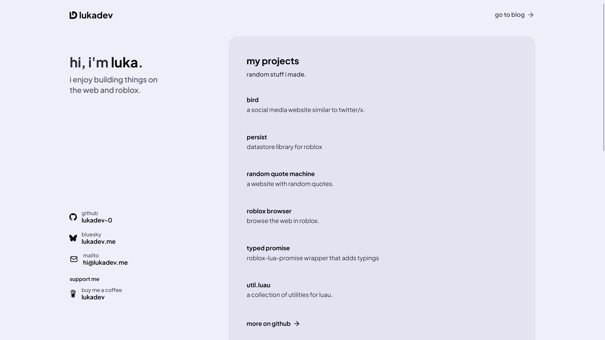
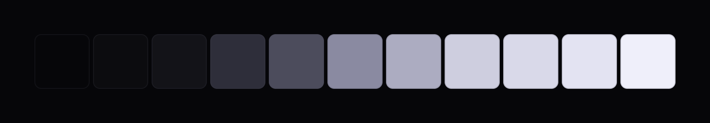

I redesigned my website. It now has a more refined color palette, support for
light mode, and the homepage got a new layout and some nice animations.

## color palette

The new website uses a new, custom color palette. Before we were using
TailwindCSS default colors, but now we have a more refined palette custom
set of colors that fit the overall design of the website better.

## light mode

The website now respects the system theme and has light mode!

## homepage

The new homepage has a two column layout. The left column has a short about me
and social links. The right column has a list of my projects and a list of
recent blog posts.

The biggest change is the entry animation. When you visit the homepage, the
content fades in with a really nice and smooth animation.

This animation is powered by [Motion](https://motion.dev/), formerly
Framer Motion. Motion provides a [mini `animate` function](https://motion.dev/docs/animate#mini)
that uses the [Web Animations API](https://developer.mozilla.org/en-US/docs/Web/API/Web_Animations_API)
(WAAPI) under the hood for hardware accelerated animations. `animate` extends
WAAPI with a simpler API, and makes it easy to do cool stuff like staggering
animations.

[Check out the homepage and the animation](/)!

## read the code

The code for this website is available in [the GitHub repository](https://github.com/lukadev-0/personal-website).
